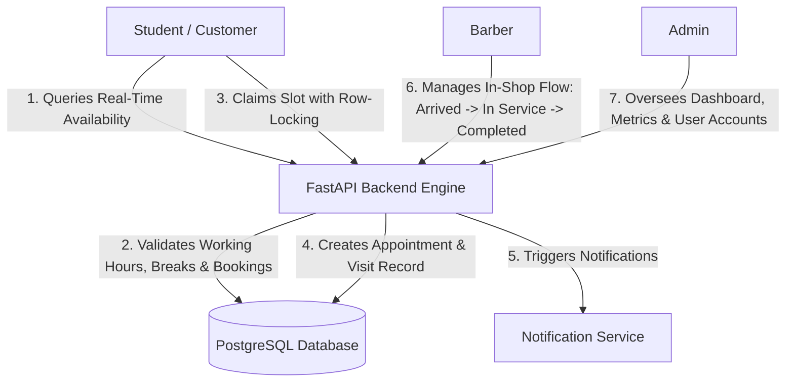
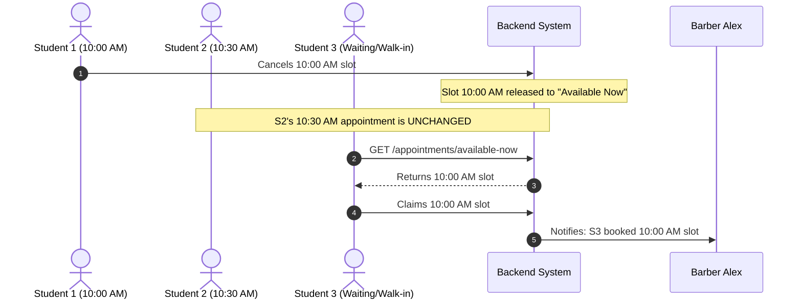
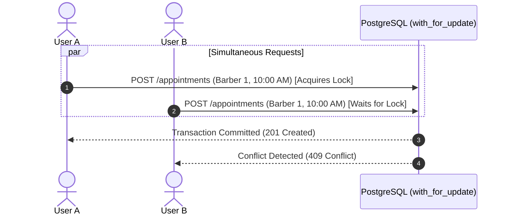
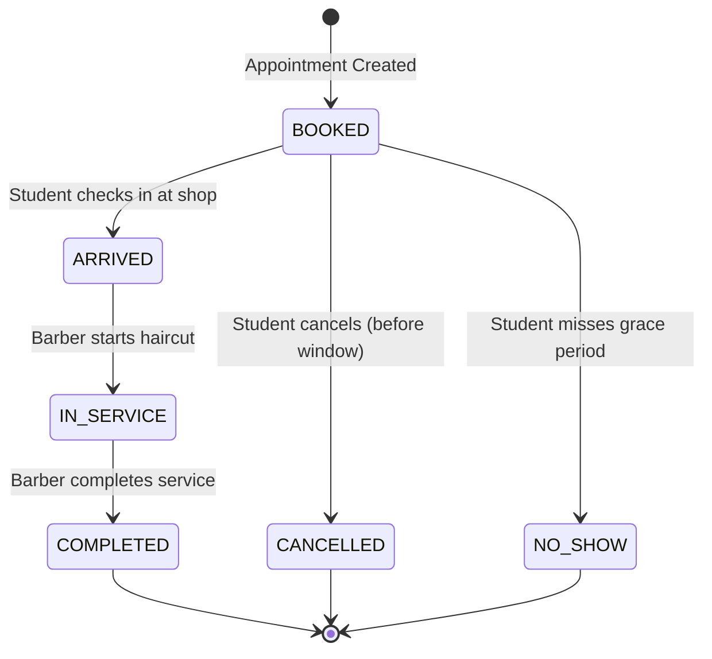
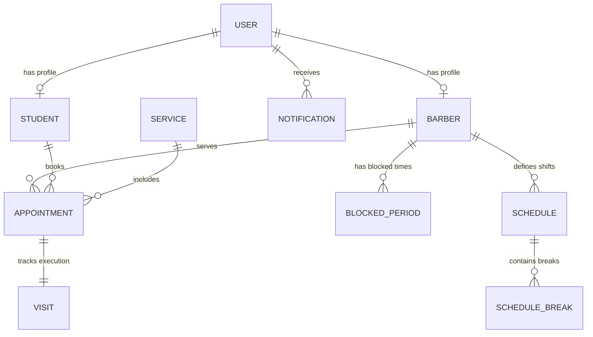

# How the Barber Shop Management System Works

A comprehensive guide explaining the architecture, core business rules, operational lifecycles, and data flows of the **Barber Shop Appointment & Visit Management System**.

---

## 1. System Overview & Purpose

The **Barber Shop Appointment & Visit Management System** is designed for high-efficiency scheduling and physical visit tracking (e.g. in campus or modern salon environments). 

Traditional appointment systems suffer from cascading delays, awkward shifting of schedules when someone is late or cancels, and race conditions during peak booking hours. This system solves those problems through **six non-negotiable core invariants**.

---

## 2. The 6 Core System Invariants & Rules

### 1. The Fixed Appointment Principle (No Cascading Shifts)
- **Rule**: When an appointment is confirmed for a specific time (e.g. 10:00 AM – 10:30 AM), it is **permanently fixed** to that exact slot.
- **Why**: In traditional queue systems, if an earlier appointment finishes early, is cancelled, or is marked a no-show, subsequent appointments are shifted earlier. This causes chaos when customers arrive at their original booked time only to find they were called early.
- **Behavior**: If a 10:00 AM appointment is cancelled or no-showed, the 10:30 AM, 11:00 AM, and all downstream appointments **remain at their exact scheduled times**.

---

### 2. The "Available Now" Claiming System
- **Rule**: When a slot is freed due to a **cancellation** or a **no-show**, it is marked as an **Available Now** slot.
- **Behavior**: Any waiting or walk-in student can immediately claim that released time slot on-demand without disturbing any other confirmed bookings.

---

### 3. Deterministic Availability Engine
- **Rule**: Service slots are dynamically calculated in real-time, taking into account:
  1. Barber's **working shift** for the day (e.g. 09:00 - 17:00).
  2. Scheduled **breaks** (e.g. Lunch 12:00 - 13:00, Tea 15:00 - 15:15).
  3. Ad-hoc **blocked periods** (e.g. equipment maintenance or personal time off).
  4. Existing active **appointments**.
  5. **Continuous service duration** (e.g. a 45-minute combo service requires a continuous 45-minute window that cannot overlap any break or booking).
- **Grid Increment**: Default 15-minute slot intervals ensure clean scheduling boundaries.

---

### 4. Concurrency & Double-Booking Prevention (Transactional Row Locking)
- **Problem**: In high-demand scenarios (e.g. slot drops), multiple students might attempt to book the exact same slot at the same millisecond.
- **Solution**: The booking service acquires a PostgreSQL database row lock (`with_for_update()`) inside an atomic database transaction.
- **Result**: The first transaction succeeds (`201 Created`), and the concurrent conflicting attempt is cleanly rejected (`409 Conflict: Selected time slot is no longer available`).

---

### 5. Decoupled Booking vs. Physical Visit State Machine
- **Separation of Concerns**:
  - `Appointment`: Represents the calendar reservation and intent.
  - `Visit`: Represents the physical execution and time tracking inside the barber shop.
- **Strict State Progression**:
  $$\text{BOOKED} \longrightarrow \text{ARRIVED} \longrightarrow \text{IN\_SERVICE} \longrightarrow \text{COMPLETED}$$
- **State Invariants**:
  - A visit cannot go to `IN_SERVICE` unless the student is first marked `ARRIVED`.
  - A visit cannot be `COMPLETED` unless it is currently `IN_SERVICE`.
  - Durations (`actual_duration_minutes`) are calculated from timestamps upon completion.

---

### 6. Role-Based Access Control (RBAC)
Every endpoint is guarded by cryptographic JWT token validation and role checks:
- **`STUDENT`**: Can view services, query availability, book/cancel own appointments, view own visits and notifications.
- **`BARBER`**: Can manage own working schedules/breaks, view own appointments, execute visit lifecycles (`arrive`, `start-service`, `complete`), and mark no-shows.
- **`ADMIN`**: Complete system oversight—view business dashboard metrics, inspect invariant rules, activate/deactivate user accounts, approve barbers, and batch-import students.

---

## 3. Core Data Architecture

### Key Entities:
1. **`User`**: Base authentication record (username, email, hashed password, role, active status).
2. **`Student`**: University student profile (student ID number, department, year of study).
3. **`Barber`**: Barber profile (bio, specialties, station/chair number, approval status).
4. **`Service`**: Available hair/grooming services (name, description, duration in minutes, price).
5. **`Schedule` & `ScheduleBreak`**: Weekly shift hours (or specific calendar date overrides) and lunch/tea breaks.
6. **`BlockedPeriod`**: Ad-hoc unavailable windows (maintenance, sick leave).
7. **`Appointment`**: Scheduled reservations with fixed start/end timestamps and statuses.
8. **`Visit`**: Real-time tracking of check-in time, service start, service finish, and actual duration.
9. **`Notification`**: Real-time alerts for booking confirmations, cancellations, no-shows, and visit completions.

---

## 4. End-to-End User Journeys

### A. The Student's Journey
1. **Browse & Explore**: Student logs in $\rightarrow$ lists active services (`GET /api/v1/services/`) and approved barbers (`GET /api/v1/barbers/`).
2. **Availability Lookup**: Requests available slots for a chosen date and service (`GET /api/v1/appointments/availability?barber_id=1&service_id=1&date=2026-09-28`).
3. **Slot Booking**: Chooses a slot and books (`POST /api/v1/appointments/`). System locks the slot, creates the appointment, generates the linked `Visit` record, and dispatches confirmation notifications.
4. **In-Shop Experience**: Student arrives at the shop at the scheduled time. Once service is finished, student receives a completion notification.

---

### B. The Barber's Journey
1. **Shift Setup**: Barber defines weekly hours (e.g. 09:00 - 17:00) and scheduled breaks (`POST /api/v1/schedules/`).
2. **Daily Schedule View**: Barber views all confirmed appointments for the day.
3. **Visit Tracking**:
   - When student walks in: Barber clicks `POST /api/v1/visits/{id}/arrive`.
   - When chair is ready: Barber clicks `POST /api/v1/visits/{id}/start-service`.
   - When haircut is done: Barber clicks `POST /api/v1/visits/{id}/complete`.
4. **Handling No-Shows**: If a student does not arrive after the 10-minute grace period, barber marks `POST /api/v1/appointments/{id}/no-show`. The slot is instantly published to "Available Now".

---

### C. The Administrator's Journey
1. **Monitor Operations**: Views system-wide metrics (`GET /api/v1/admin/dashboard`): total active appointments, completed visits today, total registered students and active barbers.
2. **Student Onboarding**: Batch-imports student cohorts via JSON (`POST /api/v1/admin/students/batch-import`).
3. **Barber Quality Control**: Approves or deactivates barber accounts (`PATCH /api/v1/admin/barbers/{id}/approval`).
4. **Policy Enforcement**: Reviews system configuration and operational rules (`GET /api/v1/admin/rules`).

---

## 5. Technical Specifications & Safety Guarantees

| Metric / Feature | Specification |
|---|---|
| **Backend Framework** | FastAPI (Python 3.12, Async ASGI) |
| **Database & ORM** | PostgreSQL 16 + SQLAlchemy 2.0 (Declarative Mapped columns) |
| **Migrations** | Alembic (Auto-versioned DB schema) |
| **Authentication** | Stateless JWT (HS256) with OAuth2 Bearer Tokens |
| **Password Security** | Native direct `bcrypt` hashing with automatic salt generation |
| **Concurrency Model** | Pessimistic database row locking (`SELECT ... FOR UPDATE`) |
| **Slot Resolution** | Dynamic 15-minute grid duration engine |
| **Cancellation Window** | Configurable policy (Default: 60 minutes before start) |
| **No-Show Grace Period** | Configurable policy (Default: 10 minutes past start) |

---

## 6. Where to Go Next

- To run through every endpoint interactively: see **[backend/MANUAL_TESTING_GUIDE.md](file:///Users/likhithraok/Desktop/Barber_booking/backend/MANUAL_TESTING_GUIDE.md)**.
- To view full API schemas and technical documentation: see **[backend/README.md](file:///Users/likhithraok/Desktop/Barber_booking/backend/README.md)**.
- To run automated tests: execute `./.venv/bin/pytest -v`.
